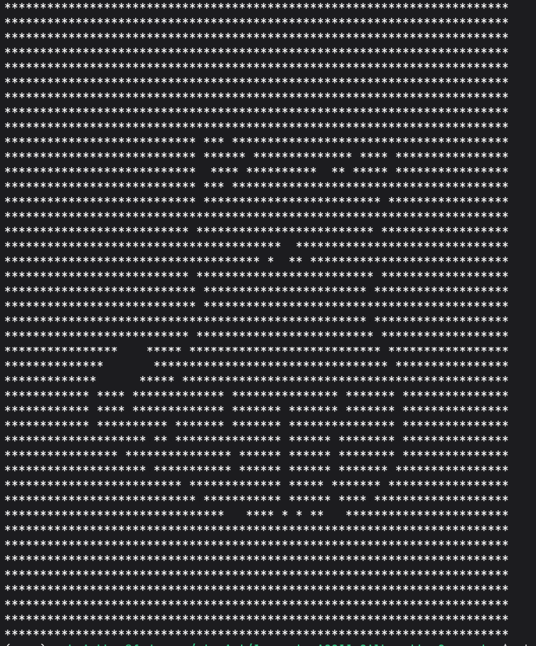
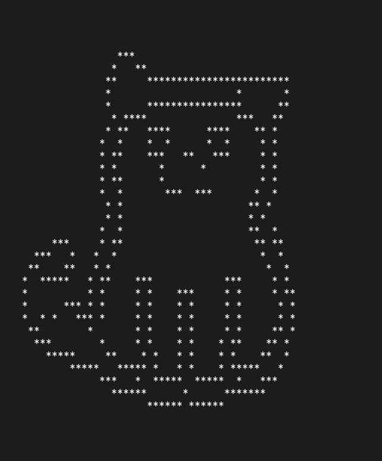

# StarArt

StarArt converts images into terminal-based art using characters such as `*`.

Instead of directly converting pixels into ASCII characters, StarArt processes the image first to extract its **shape, edges, or object segmentation**, and then renders the result inside the terminal.

## How It Works

```text
Image
  ↓
Image Processing
  ↓
Binary Mask
  ↓
Resize for Terminal
  ↓
Character Rendering
  ↓
StarArt
```

## Modes

### 1. Threshold

Converts the image into a grayscale image and applies thresholding to create a filled binary mask.

```bash
starart catcartoon.jpeg --mode threshold
```

Example:


### 2. Outline

Uses Canny edge detection to detect the edges of objects and render their outline in the terminal.

```bash
starart image.jpg --mode outline
```

Example:



### 3. Silhouette

Uses SAM2 to segment an object from the image.

The user selects a point on the object, and SAM2 generates a segmentation mask. StarArt then converts that mask into terminal art.

```bash
starart image.jpg --mode silhouette
```

Example:

soon.....

### ASCII

Converts the image into grayscale ASCII art using different characters based on brightness.

```bash
starart image.jpg --mode ascii
```

You can also control the output width:

starart image.jpg --mode ascii --width 80

And provide your own brightness gradient:

starart image.jpg --mode ascii --char " .:-=+*#%@"


## Customization

### Change output width

```bash
starart image.jpg --mode outline --width 80
```

### Change rendering character

```bash
starart image.jpg --mode outline --char "#"
```

Example:

soon ...

## SAM2

Silhouette mode requires the optional SAM2 dependencies.

Install them with:

```bash
pip install "starart[sam2]"
```

Without SAM2, the threshold and outline modes can still be used.

### Example

Input:

Add original input image here

Output:

Add terminal screenshot here
